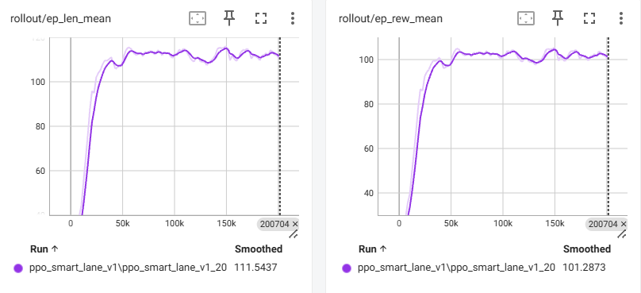

# High-Speed Autonomous Highway Agent

A Reinforcement Learning agent capable of navigating dense, stochastic highway traffic at high speeds (90+ km/h).

**Result:** The agent achieves a **100% success rate** in both standard and **2x Heavy Traffic** scenarios, demonstrating generalized collision avoidance behaviors.

_Figure 1: Final training run (PPO). Left: Mean Episode Length (Survival). Right: Mean Reward. Note the stability and high convergence (Max ~112 steps)._

---

## Project Overview

The goal of this project was to train an autonomous vehicle to navigate a multi-lane highway environment (`highway-fast-v0`) with competing objectives:

1.  **Safety:** Avoid collisions at all costs.
2.  **Efficiency:** Maintain high speeds (>90 km/h).
3.  **Stability:** Smooth lane changes without erratic behavior.

While initial baselines (DQN) struggled with "lazy" driving or aggressive crashing, the final **PPO (Proximal Policy Optimization)** agent mastered the environment through strategic reward shaping and curriculum adjustments.

---

## Key Optimizations

The success of the agent (Model: `ppo_smart_lane_v1`) is attributed to these critical configuration changes:

### 1. Reward Shaping

- **Severe Collision Penalty:** Increased from `-1.0` to `-5.0`. The agent learned that "death" is too expensive to risk for minor gains.
- **Aggressive Speed Incentive:** `reward_speed_range` set to `[25, 30]` m/s.
  - _Effect:_ The agent gets **zero** reward for driving safely at 80 km/h. It is _forced_ to overtake and weave to gain points, eliminating "passive" local minima.
- **Removed Lane Bias:** `right_lane_reward` set to `0.0`. The agent is free to use any lane necessary to maintain velocity.

### 2. Observation Space

- **Look-ahead:** `vehicles_count` set to **20**.
  - _Effect:_ Provides enough context to spot traffic jams early, without overwhelming the network with irrelevant distant cars (training efficiency).
  - _Features:_ `["presence", "x", "y", "vx", "vy"]` (Heading removed to simplify inputs).

### 3. Algorithm (PPO)

- **Entropy Coefficient:** `0.01`. Prevents early convergence to "driving straight" by encouraging exploration during the critical 50k-100k step phase.
- **Policy Frequency:** `2 Hz`. Increased decision rate allows for sub-second reaction times at high speeds.

---

## Performance & Stress Tests

The agent was evaluated on unseen seeds and varying traffic densities.

| Scenario       | Traffic Density | Result   | Notes                                   |
| -------------- | --------------- | -------- | --------------------------------------- |
| **Standard**   | 30 Vehicles     | **100%** | Flawless navigation.                    |
| **Heavy (2x)** | **60 Vehicles** | **100%** | Handles "boxed-in" scenarios perfectly. |
| **Light**      | 10 Vehicles     | 90%      | High-risk/High-reward top-speed runs.   |

_Evaluation script: `src/stress_test.py`_

---

## Project Structure

- `src/config.py`: Centralized configuration for Environment and Rewards.
- `src/train_ppo.py`: PPO training pipeline using Stable Baselines3.
- `src/stress_test.py`: generalization testing suite.
- `agents/`: Saved model checkpoints.
  - **Best Model:** `agents/ppo_smart_lane_v1.zip`
