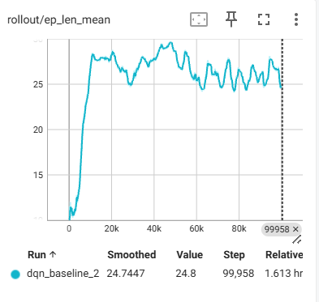
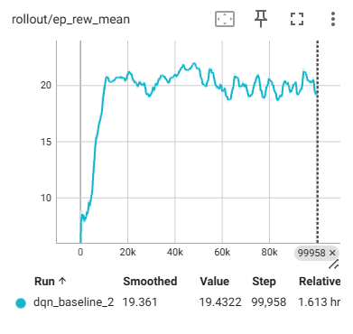

# Highway-RL

Autonomous vehicle navigation using Deep Reinforcement Learning. Built with highway-env and Stable Baselines3.

## Results

The DQN agent was trained for 100,000 timesteps on the Highway-v0 environment.

### Training Curves

  
  

The agent exhibits rapid early learning within the first 10k timesteps, followed by convergence.
The strong correlation between episode length and reward indicates a survival-based reward structure.
